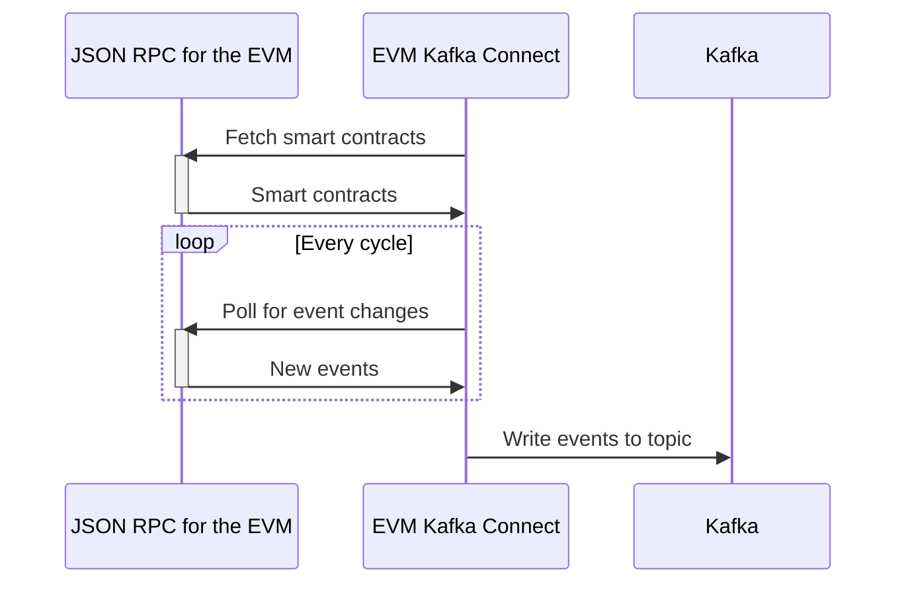

# Kafka Connect EVM Connector

[](https://github.com/phil3k3/kafka-connect-evm/actions/workflows/maven.yml)

kafka-connect-evm is a [Kafka Connector](http://kafka.apache.org/documentation.html#connect)
for ingesting events emitted from smart contracts deployed at any EVM-compatible blockchain.

For details regarding supported chains, visit https://github.com/web3j/web3j.

It uses the following two essential libraries under the hood:
* web3j https://github.com/web3j/web3j
* Kafka Connect API

# Development

You can build kafka-connect-evm with Maven using the standard lifecycle phases.

# Contribute

Contributions can only be accepted if they contain appropriate testing. 

- Source Code: https://github.com/phil3k3/kafka-connect-evm
- Issue Tracker: https://github.com/phil3k3/kafka-connect-evm/issues

# Running in development

To run the tests you need to have a valid API key for Etherscan. For details regarding the Layer 1 Ethereum
chain, visit https://docs.etherscan.io/getting-started/viewing-api-usage-statistics. 


Build a new package:
```
export ETHERSCAN_API_KEY=...
mvn clean package
```

Launch the dependencies using docker compose
```
docker-compose --verbose up -d
```

Create a new EVM connector using the rest API:
```
export ETHERSCAN_API_KEY=...
curl -XPUT http://localhost:8083/connectors/evm/config \
-H "Content-Type: application/json" \
-d '{
  "connector.class": "at.fincloud.Web3SourceConnector",
  "tasks.max": "1",
  "topics": "test-topic",
  "contract.addresses": "0x606265A4A8A8A8599CFe9B952108c64C05978E41",
  "rpc.url": "https://gateway.tenderly.co/public/polygon-mumbai",
  "block.from": "43206757",
  "block.to": "43767970",
  "etherscan.uri": "https://mumbai.polygonscan.com/api",
  "etherscan.api.key": "'"$ETHERSCAN_API_KEY"'",
  "topic": "test-topic"
}'
```

Check the logs of the connector container:

```
docker logs connect -f 
```

# Sequence diagram


